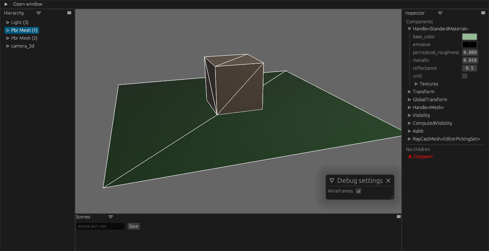

# bevy_editor_pls

> :warning: **This is very much work in progress**: Take a look at the [missing features](#missing-features) to see if your use case isn't yet supported.

Adds debug tools to your bevy game, including

- hierarchy view and component inspector
- separate editor camera
- some builtin editor panels for diagnostics, debug settings
- scene export

**This is not, and isn't meant to be, comparable to the actual editor bevy will end up with. `bevy_editor_pls` attempts to get the low hanging fruits by adding editor UI to the game executable, without having all the complexity that comes with having a proper well-designed editor architecture.**

## How to use:

Add the `EditorPlugin`:

```diff
+use bevy_editor_pls::prelude::*;

fn main() {
    App::new()
        .add_plugins(DefaultPlugins)
+       .add_plugin(EditorPlugin::default())
        ...
        .run();
}
```



### Custom editor panels

```rust
use bevy_editor_pls::{egui, prelude::*};
use bevy_editor_pls_core::editor_window::{EditorWindow, EditorWindowContext};

fn main() {
    App::new()
        ...
        .add_editor_window::<MyEditorWindow>()
        ...
        .run();
}

pub struct MyEditorWindow;
struct MyEditorWindowState {
}
impl EditorWindow for MyEditorWindow {
    type State = MyEditorWindowState;
    const NAME: &'static str = "Another editor panel";

    fn ui(world: &mut World, cx: EditorWindowContext, ui: &mut egui::Ui) {
        let currently_inspected = &cx.state::<MyEditorWindow>().unwrap().selected;

        ui.label("Anything can go here");
    }
}
```

### Controls

The default controls are:

- `E` to toggle the editor
- `Ctrl+Enter` to pause/unpause time
- `F` to focus selected entity
- `T/R/S` to show translate/rotate/scale gizmo
- Double click on the menu bar to go fullscreen

Cameras:

- `2d (Pan/Zoom)`: any mouse button to pan, scroll to zoom
- `3d (Free)`: `WASD + Ctrl/Shift` + `Shift` for a speed boost for the free 3d camera
- `3d (Pan/Orbit)`: `Right click` to rotate around focus, `Middle mouse button` to pan

<details>
<summary>Changing the default controls</summary>

```rust
use bevy_editor_pls::EditorPlugin;
use bevy_editor_pls::controls;
use bevy_editor_pls_default_windows::hierarchy::picking::EditorRayCastSource;

fn main() {
    App::new()
        // ..
        .add_plugin(EditorPlugin)
        .insert_resource(editor_controls())
        .add_startup_system(set_cam3d_controls)
        // ..
        .run();
}

fn editor_controls() -> EditorControls {
    let mut editor_controls = EditorControls::default_bindings();
    editor_controls.unbind(controls::Action::PlayPauseEditor);

    editor_controls.insert(
        controls::Action::PlayPauseEditor,
        controls::Binding {
            input: controls::UserInput::Single(controls::Button::Keyboard(KeyCode::Escape)),
            conditions: vec![controls::BindingCondition::ListeningForText(false)],
        },
    );

    editor_controls
}

fn set_cam3d_controls(
    mut query: Query<&mut bevy_editor_pls::default_windows::cameras::camera_3d_free::FlycamControls>,
) {
    let mut controls = query.single_mut();
    controls.key_up = KeyCode::Q;
    controls.key_down = KeyCode::E;
}
```

</details>

<br>

## Missing features

- scene import
- visualization of invisible entities in editor (to see where the camera is for example)

## Bevy support table

| bevy | bevy_editor_pls |
| ---- | --------------- |
| 0.10 | 0.4             |
| 0.10 | 0.3             |
| 0.9  | 0.2             |
| 0.8  | 0.1             |
