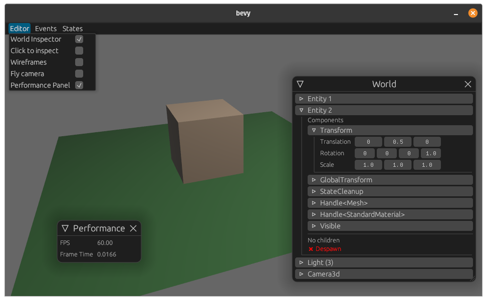

# bevy_editor_pls


<!--
<div align="center">
  <a href="https://crates.io/crates/bevy-inspector-egui">
    
  </a>
  <a href="https://docs.rs/bevy-inspector-egui">
    
  </a>
    
</div>
<br/>
-->


Adds a menu bar to the app which has the following features:
- you can enable the **World Inspector**
- you can also enable **click to select**
  For that to work, you need to tag your camera with `PickingCameraBundle` and your meshes with `PickableBundle` or enable `EditorSettings::auto_clickabl`, see the [example](./examples/main.rs) for a full demo.
  Ctrl-Click an object to open the inspector.
- switch to app states you have registered using `EditorSettings::add_state`
- some more things (flycam, performance panel)





### Setup

To add the editor to your app, simply add the `EditorPlugin`:

```rust
use bevy::prelude::*;

fn main() {
    App::build()
        .add_plugins(DefaultPlugins)
        .add_plugin(bevy_editor_pls::EditorPlugin)
        .run();
}
```

If you want to modify some aspects of the editor you can do so using the `EditorSettings`:

### Settings

```rust
use bevy_inspector_pls::EditorSettings;

fn editor_settings() -> EditorSettings {
    let mut settings = EditorSettings::default();
    settings.auto_pickable = true; // automatically adds the `PickableBundle` to game objects

    // Adds the `Event > AppExit` menu item
    settings.add_event("Quit", || AppExit);

    // Adds `State > MainMenu` and `State > Game` menu items for switch to the respective states
    settings.add_state("Main menu", AppState::MainMenu);
    settings.add_state("Game", AppState::Game);

    // Will spawn a gltf scene when a file is dropped into the window
    settings.on_file_drop(&["gltf", "glb"], |path, world| {
        let asset_path = AssetPath::new_ref(path, Some("Scene0".into()));
        let asset_server = world.get_resource_mut::<AssetServer>().unwrap();
        let scene_handle = asset_server.load(asset_path);

        let mut spawner = world.get_resource_mut::<SceneSpawner>().unwrap();
        spawner.spawn(scene_handle);
    });

    settings
}
```

```diff
fn main() {
    App::build()
+       .insert_resource(editor_settings())
        .add_plugins(DefaultPlugins)
        .add_plugin(EditorPlugin)
        .run();
}
```

As shortcut to automatically add the necessary bundles for mouse picking and the fly camera you can simply insert `EditorSettings::automagic()`. You can look at the documentation for more information.

### Keyboard shortcuts

To add the default keyboard shortcuts, add `.add_startup_system(bevy_editor_pls::setup_default_keybindings.system())` to your app.

This will bind `Ctrl + F` to toggling the fly cam, `Ctrl + P` will open the performance panel, `Ctrl + W` the world inspector and `Ctrl + Escape` will hide the editor ui.
You can add your own keybindings using a startup system like this:
```rust
pub fn setup_default_keybindings(mut input: ResMut<InputMap<EditorAction>>) {
  input.bind(EditorAction::ToggleWorldInspector, vec![KeyCode::LControl, KeyCode::W]);
}
```